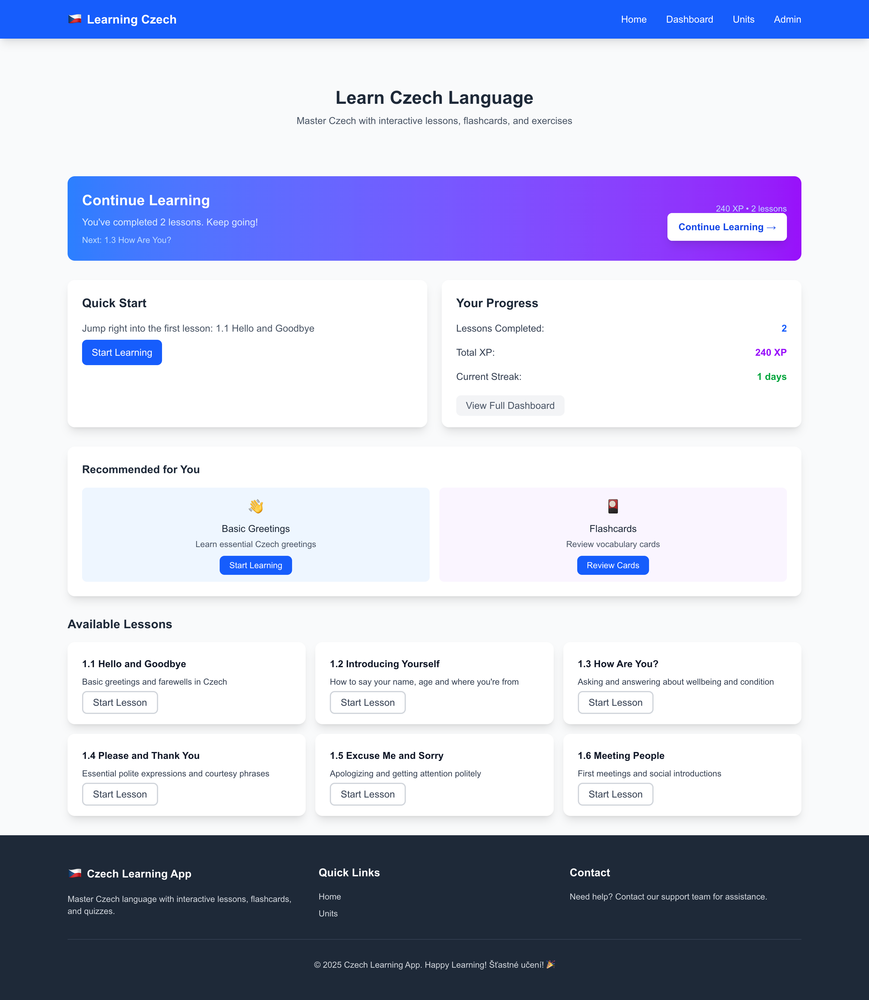
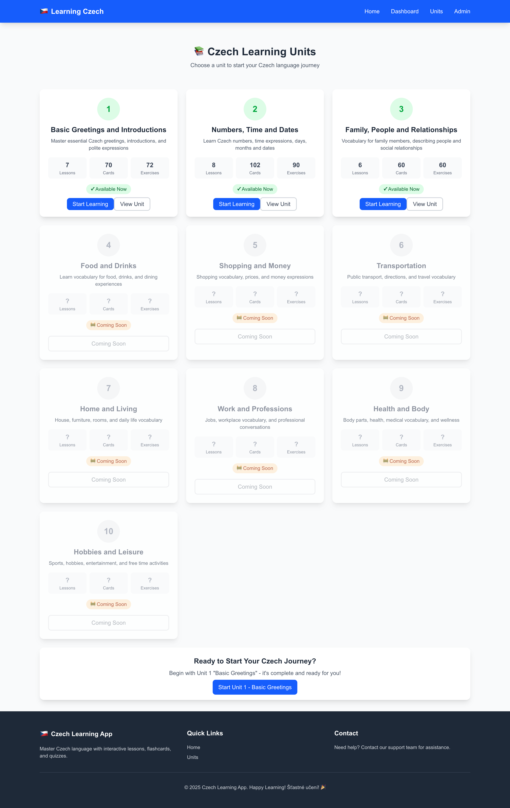
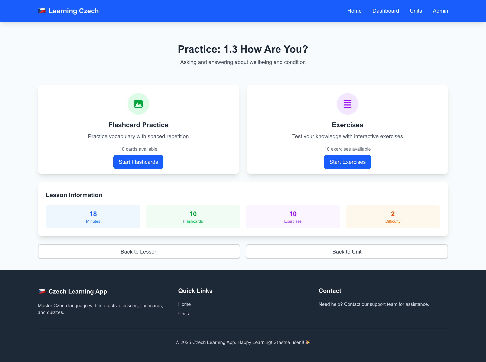
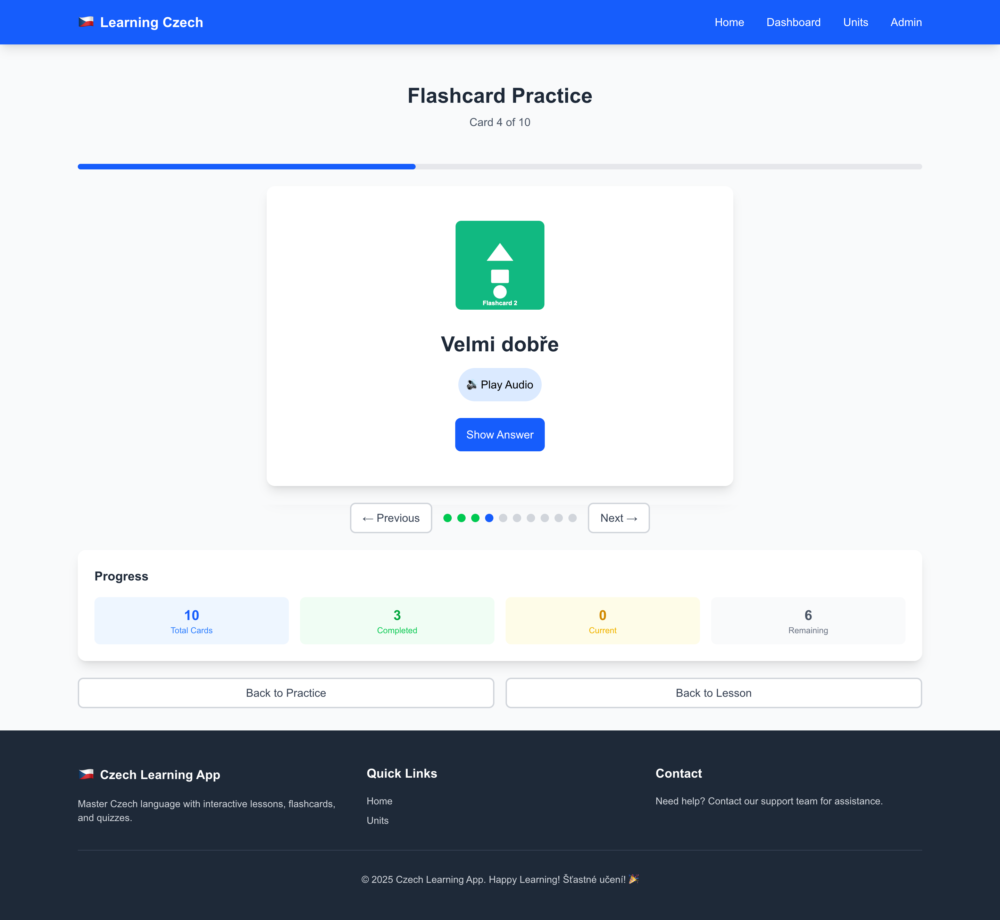
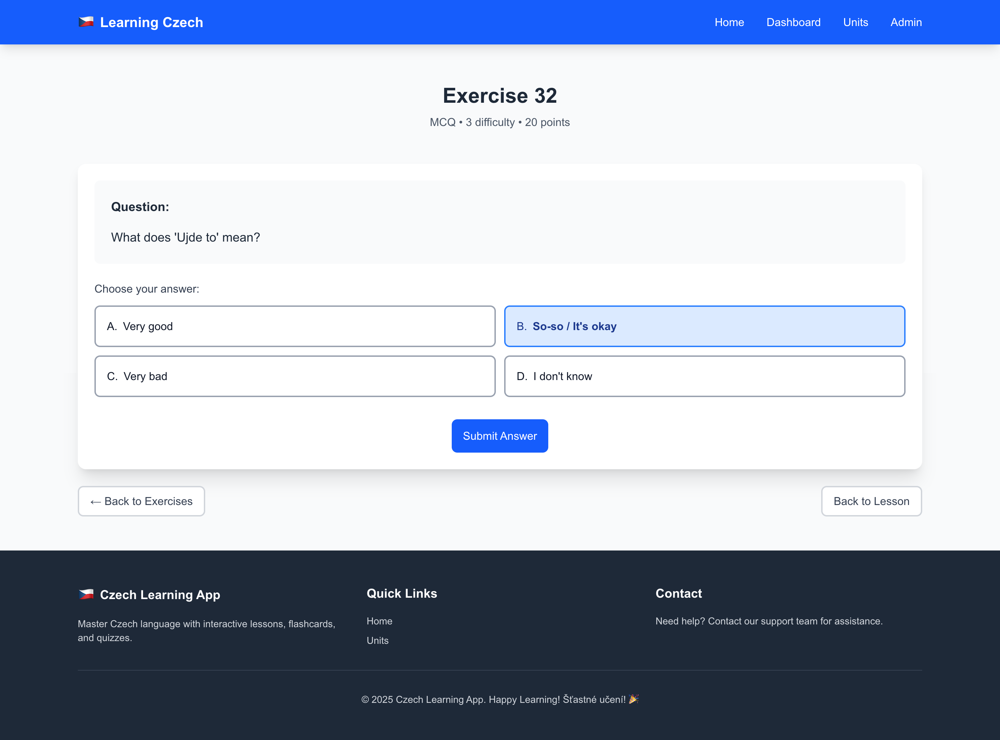
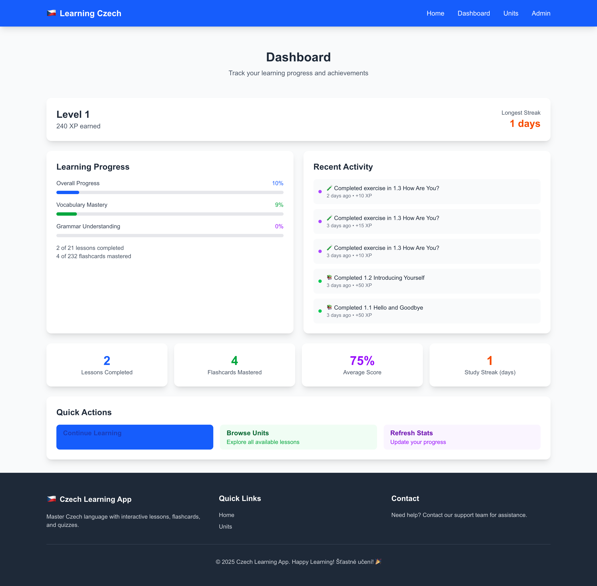

# 🇨🇿 Czech Learning App

**Modern, full-stack language learning platform** built with Next.js 15 and TypeScript. Features interactive lessons, smart flashcards, and comprehensive progress tracking - deployed to production with real users.

**🚀 Live Demo:** [https://learning-czech-app.vercel.app/](https://learning-czech-app.vercel.app/)

[](https://nextjs.org/)
[](https://www.typescriptlang.org/)
[](https://learning-czech-app.vercel.app/)

## 🎯 Key Features & Highlights

- **21 Complete Interactive Lessons** organized in 3 comprehensive learning units
- **Smart Flashcard System** with spaced repetition algorithm for optimal retention
- **Multiple Exercise Types**: Multiple choice, fill-in-the-blank, and matching games
- **Real-time Progress Tracking** with XP system, learning streaks, and detailed analytics
- **Responsive Design** optimized for desktop, tablet, and mobile devices
- **Production-Ready** with PostgreSQL database and serverless deployment

## 📸 Application Screenshots

### 🏠 Dynamic Homepage with Progress Tracking



_Smart "Continue Learning" functionality with personalized progress tracking and unit-based learning path_

### 📚 Learning Units Overview



_Comprehensive learning units with progress tracking and coming soon features_

### 📖 Interactive Lesson Interface



_Rich multimedia content with audio pronunciation, visual aids, and structured learning progression_

### 🎴 Smart Flashcard System



_Interactive flashcards with spaced repetition algorithm, visual feedback, and audio pronunciation_

### 🎯 Diverse Exercise System



_Multiple exercise formats including multiple choice, fill-in-the-blank, and interactive matching games_

### 📊 Comprehensive Analytics Dashboard



_Real-time learning analytics with detailed progress tracking, XP system, and performance insights_

## 🛠️ Technical Implementation

### **Frontend Architecture**

- **Next.js 15** with App Router for modern React development
- **TypeScript** for type-safe, maintainable code
- **Tailwind CSS** for responsive, utility-first styling
- **React Hooks** for efficient state management

### **Backend & Database**

- **Next.js API Routes** for serverless backend functionality
- **Prisma ORM** for type-safe database operations
- **PostgreSQL** (Neon) for production with automatic scaling
- **SQLite** for local development environment

### **Deployment & DevOps**

- **Vercel** for seamless CI/CD and global edge deployment
- **Git-based workflow** with automated deployments
- **Environment-specific configurations** for dev/prod

## 🚀 Quick Start

```bash
# Clone the repository
git clone https://github.com/Gamze-Mise/learning-czech-app.git
cd learning-czech-app

# Install dependencies
npm install

# Set up database
npx prisma migrate dev
npx prisma db seed

# Start development server
npm run dev
```

Open [http://localhost:3000](http://localhost:3000) to view the application.

## 📈 Project Statistics

- **21 Interactive Lessons** across 3 comprehensive learning units
- **50+ Dynamic Flashcards** with spaced repetition algorithm
- **100+ Practice Exercises** with intelligent answer validation
- **Full Progress Tracking** with XP system and learning streaks
- **Responsive Design** supporting desktop, tablet, and mobile
- **Production Deployment** with real user engagement

## 🎯 Professional Highlights

This project demonstrates:

- **Full-stack development** expertise with modern technologies
- **Database design** and ORM implementation
- **User experience** focus with intuitive interface design
- **Production deployment** and DevOps best practices
- **Scalable architecture** ready for real-world usage

## 👨‍💻 Developer

**Gamze Mise Vural** - Full Stack Developer  
📧 [GitHub Profile](https://github.com/Gamze-Mise)  
🌐 [Live Application](https://learning-czech-app.vercel.app/)
