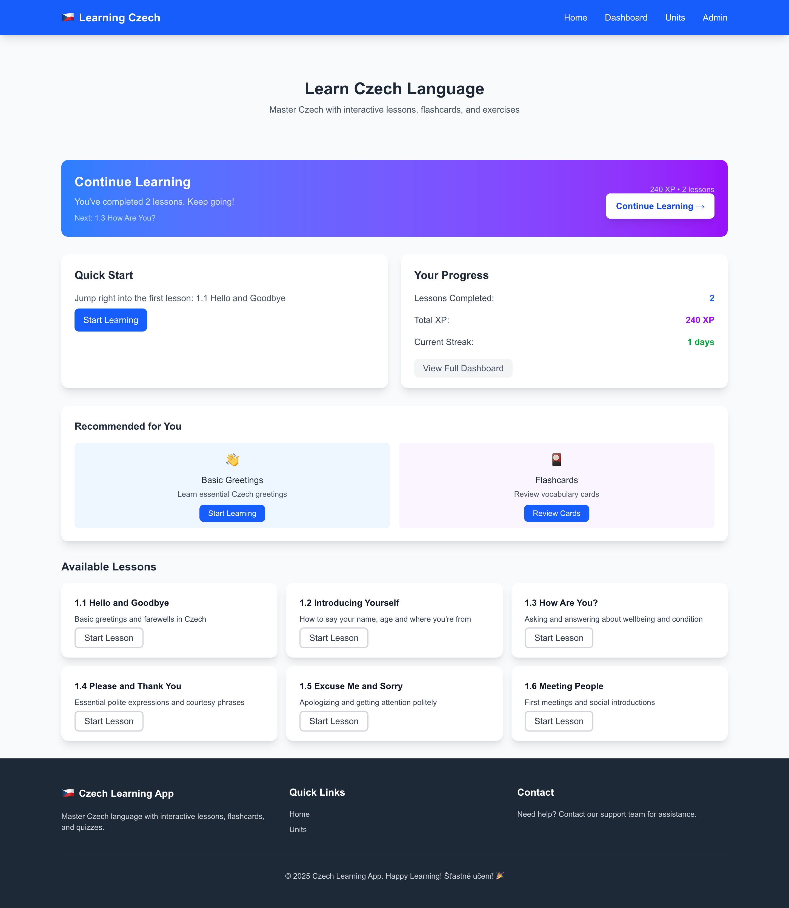
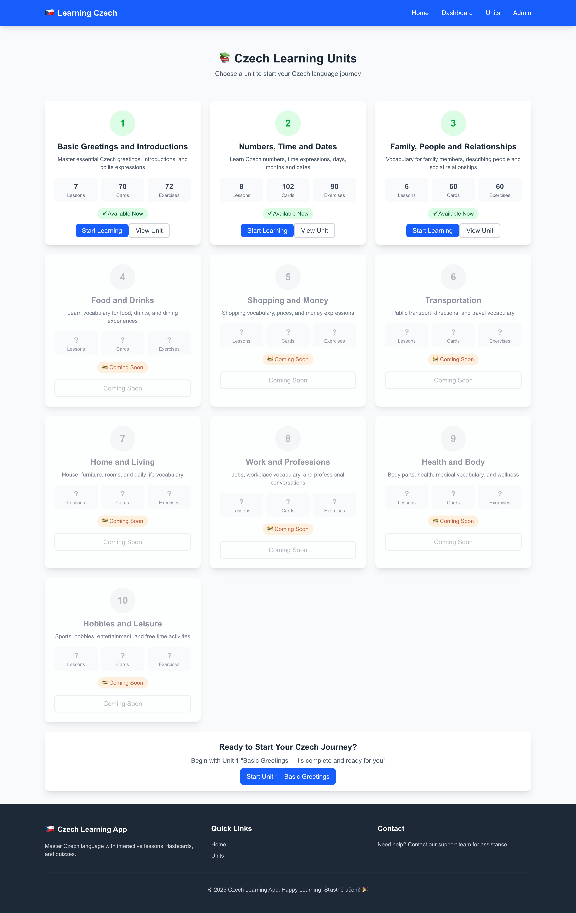
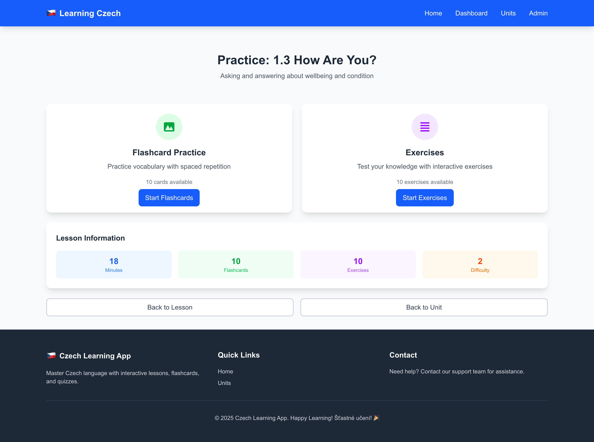
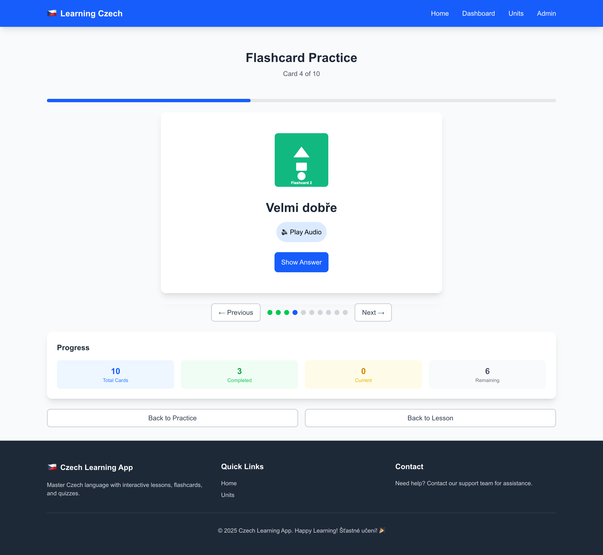
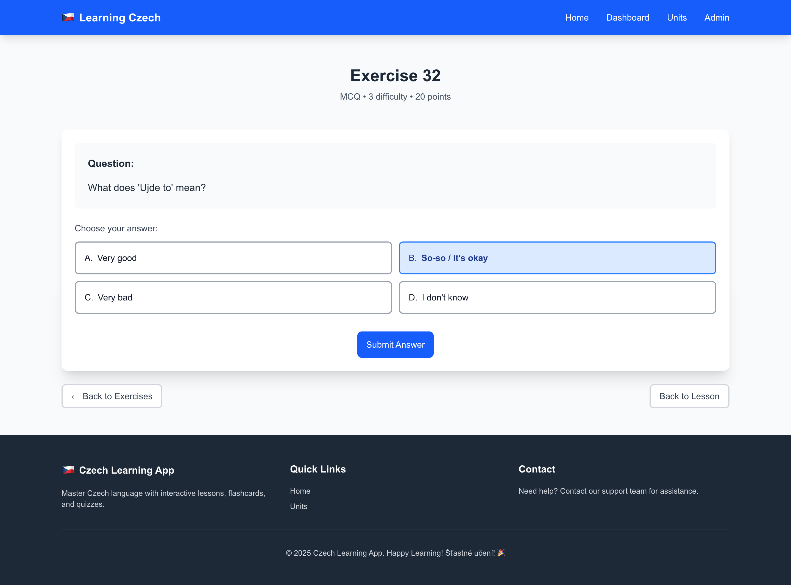
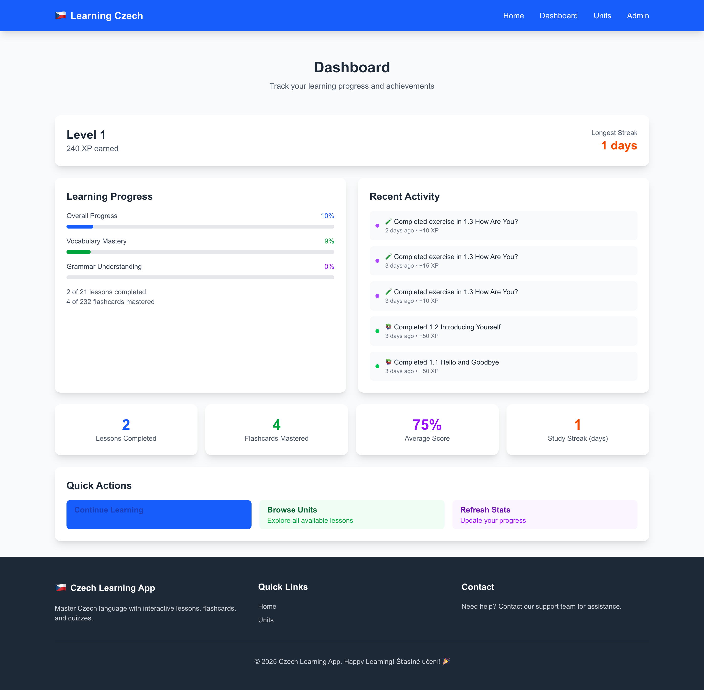

# 🇨🇿 Czech Learning App

A full-stack Czech learning application built with **Next.js**, **TypeScript**, **Prisma**, and **PostgreSQL**.  
The app includes interactive lessons, flashcards, exercises, and progress tracking in a simple and user-friendly interface.

**Live Demo:** [learning-czech-app.vercel.app](https://learning-czech-app.vercel.app/)

[](https://nextjs.org/)
[](https://www.typescriptlang.org/)
[](https://learning-czech-app.vercel.app/)

## Features

- Interactive Czech lessons organized into learning units
- Flashcard practice for vocabulary review
- Different exercise types such as multiple choice and fill-in-the-blank
- Progress tracking for completed lessons and exercises
- Responsive UI for desktop and mobile use
- Full-stack setup with database integration and deployment on Vercel

## Screenshots

### Homepage


### Learning Units


### Lesson Page


### Flashcards


### Exercises


### Dashboard


## Tech Stack

### Frontend
- Next.js 15
- React
- TypeScript
- Tailwind CSS

### Backend
- Next.js API Routes
- Prisma ORM

### Database
- PostgreSQL (Neon)
- SQLite for local development

### Deployment
- Vercel

## Getting Started

```bash
git clone https://github.com/Gamze-Mise/learning-czech-app.git
cd learning-czech-app
npm install
npx prisma migrate dev
npx prisma db seed
npm run dev
